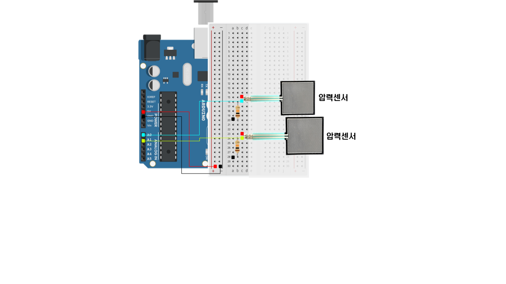

# 2022년도 EL 하계 프로젝트

## IoT App조   
프로젝트 기간 : 2022.07.04(월)~08.21(일)

[조장] 조희우   
[조원]   
- 1학년 : 김신영, 김준호   
- 2학년 : 김진희, 김혜현   

---
## 주제   
스마트 책상 & 의자   

---
## 역할
※ 이름 순서로 정렬
1. 김신영   
    - PPT 제작
    - 솔레노이드 잠금센서

2. 김준호   
    - 영상 편집
    - 공기질 센서

3. 김진희   

4. 김혜현   

5. 조희우   


---
## 책상
1. 구현자    
김진희   

2. 기능   
 - 공기 온습도 측정
    + LCD에 측정 온도, 습도 값 표시
 - 공기질 (이산화탄소) 측정
    + 측정값이 기준치 이상 올라갈 시 LED 점등
 - 가습기 모듈 작동
    + 자동/수동 버튼 제어
    + 자동 : 온습도 값에 따라 작동
 - 가습기 모듈 원격 제어

3. 사용 부품   
 - 보드 : Arduino R3
 - 블루투스 모듈 : HC-06
 - 온습도 센서 : DHT-11
 - 공기질 센서 : SZH-SSBH-038
 - 가습기 모듈 : SZH-HUM002
 - 모스펫 : Irf520
 - LCD : 1602 IC2
 - LED : red
 - 버튼   

4. 라이브러리   
 - DHT
 - Wire
 - LiquidCrystal_I2C

5. 코드  
```Arduino
#include "DHT.h"
#include <Wire.h> 
#include <LiquidCrystal_I2C.h>
#include <SoftwareSerial.h>

LiquidCrystal_I2C lcd(0x27,16,2); //2004 -> 1602

#define DHTPIN 5
#define DHTTYPE DHT11
DHT dht(DHTPIN, DHTTYPE);

#define mosfet 2
#define btn_on 3
#define btn_off 4
#define btn 7

int bluetoothTx = 8;
int bluetoothRx = 9;

SoftwareSerial bluetooth(bluetoothTx, bluetoothRx);

int humi_max = 75;
int humi_min = 50;

int led = 6;

unsigned long t = 0;
int a;
int b;

void setup() {
  // put your setup code here, to run once:
  Serial.begin(9600); //아두이노의 결과를 PC에 출력하겠다!
  bluetooth.begin(9600);
  dht.begin();
  lcd.init();
  lcd.backlight();
  pinMode(mosfet,OUTPUT); //모스펫핀을 출력으로 설정!
  pinMode(btn_on,INPUT); //아두이노에 내장된 저항을 이용해서 버튼을 활용하겠다!
  pinMode(btn_off,INPUT); //아두이노에 내장된 저항을 이용해서 버튼을 활용하겠다!
  pinMode(btn, INPUT);
  pinMode(led, OUTPUT);
  int a=1;
  int b=1;
}

void loop() {
 //블루투스 값 입력
 String inputString="";
 
 if(bluetooth.available()){
  inputString=bluetooth.readStringUntil('/n');
 }

 //가습기 자동 수동
 if(inputString=="자동"){
  a+=1;
 }
 else if(inputString=="수동"){
  a+=1;
 }
 
 //가습기 모듈 on/off
 if (inputString=="on"){
  b+=1;
 }
 else if(inputString=="off"){
  b+=1;
 }
  

  
  int avrPPM = averageAnalogRead(A0); 
  int co2ppm = map(avrPPM, 0, 1023, 400, 5000);
  Serial.println(co2ppm);
  delay(300);
  

  if(co2ppm > 2000){
    digitalWrite(led,HIGH);
  }
  else{
    digitalWrite(led,LOW);
  }

  if(digitalRead(btn) == HIGH){
    a+=1;
    Serial.println("모드 변경됨.");
  }

  if(a%2==0){
    Serial.println("수동모드");
    
    if(digitalRead(btn_on) == HIGH){
      //버튼이 눌려진것!
        b+=1;
     }
     if(digitalRead(btn_off) == HIGH){
        b+=1;
     }
    if(b%2!=0){
      digitalWrite(mosfet,HIGH);
      Serial.println("가습기 켬");
    }
    else{
      digitalWrite(mosfet,LOW);
      Serial.println("가습기 끔");
     }        
   }
  

  
  else{
    Serial.println("자동모드");
    if(millis() - t > 1000){
       t = millis();
      //1초에 한번 온도와 습도를 측정하세요!
      float h = dht.readHumidity();
      float t = dht.readTemperature();

      Serial.print(h);
      Serial.print("\t");
      Serial.println(t);

      lcd.setCursor(0,0); //첫번째줄~
      lcd.print("HUMI=");
      lcd.print(h);
      lcd.print("%  ");
      lcd.setCursor(0,1); //두번째줄~
      lcd.print("TEMP=");
      lcd.print(t);
      lcd.print("'C  ");
   
      if(h > humi_max){
      Serial.println("습도가 충분해서 자동으로 OFF합니다");
      digitalWrite(mosfet,LOW);
         }
      else if(h <= humi_min){
      Serial.println("습도가 낮아서 자동으로 ON합니다");
      digitalWrite(mosfet,HIGH);
          }
      else{
      Serial.println("온습도 안정");
      digitalWrite(mosfet, LOW);//이 부분은 사용자가 수정해서 사용하게 할까..
     }
    }
  }

  delay(1000);
  
}


int averageAnalogRead(int pinToRead)
{
  byte count = 10;
  float value = 0;

  for( int x = 0;  x < count ; x++){
    value += analogRead(pinToRead);
    delay(20);
  }
  
  value = value/count;
  return(value);
}
```

6. 회로도   
 

---
## 의자
1. 구현자
 김혜현

2. 기능   
 - 의자의 압력치 측정
 - 각 위치의 압력치 출력
 - 압력이 가해진 시간 측정   


3. 사용 부품   
 - 보드 : Arduino R3
 - 블루투스 모듈 : HC-06
 - 압력센서 : FSR 406 Tabs [30-73258]

4. 라이브러리   
 - DS1302

5. 코드   

```Arduino
#include <DS1302.h>
int FSR_Pin0 = A0; //analog pin 0 다리 왼쪽_엉덩이
int FSR_Pin1 = A1; //analog pin 1 다리 왼쪽_허벅지
int FSR_Pin2 = A2; //analog pin 2 다리 오른쪽_엉덩이
int FSR_Pin3 = A3; //analog pin 3 다리 오른쪽_허벅지

//시간
unsigned long timeVal;
unsigned int Read_Value = 0;
int sec;
int min;
int hour;
int second;

void setup() {
  Serial.begin(9600);
}

void loop() {
  int FSRReading0 = analogRead(FSR_Pin0);
  int FSRReading1 = analogRead(FSR_Pin1);
  int FSRReading2 = analogRead(FSR_Pin2);
  int FSRReading3 = analogRead(FSR_Pin3);

  Serial.print("왼엉 : ");
  Serial.print(FSRReading0);
  Serial.print(" 왼허 : ");
  Serial.print(FSRReading1);
  Serial.print(" 오엉 : ");
  Serial.print(FSRReading2);
  Serial.print(" 오허 : ");
  Serial.println(FSRReading3);
  delay(500);
  if(FSRReading0 > 0 || FSRReading1 > 0 || FSRReading2 > 0 || FSRReading3 > 0){
    //4개의 센서 중 하나라도 압력이 가해졌을 경우 시간 측정
    if(millis()-timeVal>=1000){
      sec++; //1초증가
      timeVal = millis();
      if(sec >= 60){
        min++; //1분 증가
        sec = 0; //초 초기화
        if(min >= 60){
          hour++; //1시간 증가
          min = 0; //분 초기화
        }
      }
      Serial.print(hour);
      Serial.print(" 시 ");
      Serial.print(min);
      Serial.print(" 분 ");
      Serial.print(sec);
      Serial.println(" 초 ");
    }
  }
  else if(FSRReading0 <= 0 || FSRReading1 <= 0 || FSRReading2 <= 0 || FSRReading3 <= 0){
    if(hour > 0 || min > 0 || sec > 0){
      if(millis()-timeVal>=1000){
       second++; //1초증가
        timeVal = millis();
        if(second > 3){
         hour = 0;
         min = 0;
         sec = 0;
        }
        Serial.print(hour);
        Serial.print(" 시 ");
        Serial.print(min);
        Serial.print(" 분 ");
        Serial.print(sec);
        Serial.println(" 초 ");
      }      
    }
  }    
  delay(500);
}
```

6. 회로도   
 

---
## 서랍
1. 구현자  
 조희우

2. 기능   
 - LED 원격 제어
 - 솔레노이드 원격 제어 / 비밀번호 인증 기능
 - 솔레노이드 RFID 제어
 - 키 인증 성공시 
    + 솔레노이드 잠금해제, 초록색 LED 점등
 - 키 인증 실패시
    + 부저울림, 붉은색 LED 점등

3. 사용 부품   
 - 보드 : Arduino R3
 - LED : 13mm 표준형 12V 방수 LED바
 - 솔레노이드 : ROB-15324
 - RFID : RC522 리더기 모듈
 - LED : red, green
 - 수동 부저
 - 릴레이모듈

4. 라이브러리    
 - SPI
 - MFRC522
 - SoftwareSerial

5. 코드  
```Arduino
#include <SPI.h>
#include <MFRC522.h>
#include <SoftwareSerial.h>
 
#define SS_PIN 10
#define RST_PIN 9
#define LED_G 5 //define green LED pin
#define LED_R 4 //define red LED
#define SOLENOID 3 //SOLENOID pin
#define BUZZER 2 //buzzer pin
#define ACCESS_DELAY 2000
#define DENIED_DELAY 1000
MFRC522 mfrc522(SS_PIN, RST_PIN);   // Create MFRC522 instance.

#define LED_BAR 6
String UID = "43 82 A6 09";
String inputString;
String PW = "1234";
String KEY;
int stringLen;

#define TX 7
#define RX 8
SoftwareSerial bluetooth(TX, RX);

void setup()
{
  Serial.begin(9600);   // Initiate a serial communication
  bluetooth.begin(9600);// Initiate Blutooth
  SPI.begin();          // Initiate  SPI bus
  mfrc522.PCD_Init();   // Initiate MFRC522
  
  pinMode(LED_G, OUTPUT);
  pinMode(LED_R, OUTPUT);
  pinMode(SOLENOID, OUTPUT);
  pinMode(LED_BAR, OUTPUT);
  pinMode(BUZZER, OUTPUT);
  noTone(BUZZER);
  digitalWrite(SOLENOID, LOW);
  digitalWrite(LED_BAR, LOW);
  
  Serial.println("Put your card to the reader...");
  Serial.println();
}
void loop()
{
  // 블루투스 값 입력
  inputString="";
  KEY="";
  if(bluetooth.available()){
    inputString=bluetooth.readStringUntil('\n');
    stringLen=inputString.length();
  }

  // 솔레노이드 블루투스
  if (inputString.endsWith("#")){
    KEY=inputString.substring(stringLen-5,stringLen-1);
    if(KEY==PW){
      Lock_off();
    }
    else{
      Lock_error();
    }
  }
  

  // 블루투스 스위치 on/off
  if(inputString=="on"){
    digitalWrite(LED_BAR, HIGH);
  }
  else if(inputString=="off"){
    digitalWrite(LED_BAR, LOW);
  }


  // 카드 인식
  if ( ! mfrc522.PICC_IsNewCardPresent())
  {
    return;
  }
  
  // UID 인식
  if ( ! mfrc522.PICC_ReadCardSerial())
  {
    return;
  }

  // UID 출력
  Serial.print("UID tag :");
  String content= "";
  byte letter;
  for (byte i = 0; i < mfrc522.uid.size; i++)
  {
     Serial.print(mfrc522.uid.uidByte[i] < 0x10 ? " 0" : " ");
     Serial.print(mfrc522.uid.uidByte[i], HEX);
     content.concat(String(mfrc522.uid.uidByte[i] < 0x10 ? " 0" : " "));
     content.concat(String(mfrc522.uid.uidByte[i], HEX));
  }
  Serial.println();
  Serial.print("Message : ");
  content.toUpperCase();


  // UID 대조
  if (content.substring(1) == UID)
  {
    Serial.println("Authorized access");
    Serial.println();
    delay(500);
    Lock_off();
  }
 
 else   {
    Serial.println(" Access denied");
    Lock_error();
  }  

}

void Lock_error(){
  digitalWrite(LED_R, HIGH);
  tone(BUZZER, 300);
  delay(DENIED_DELAY);
  digitalWrite(LED_R, LOW);
  noTone(BUZZER);
}
void Lock_off(){
  digitalWrite(SOLENOID, HIGH);
  digitalWrite(LED_G, HIGH);
  delay(ACCESS_DELAY);
  digitalWrite(SOLENOID, LOW);
  digitalWrite(LED_G, LOW);
}
```

6. 회로도   
 

---
## 앱인벤터
1. 로딩화면
2. 메인화면
3. 온습도
4. 
